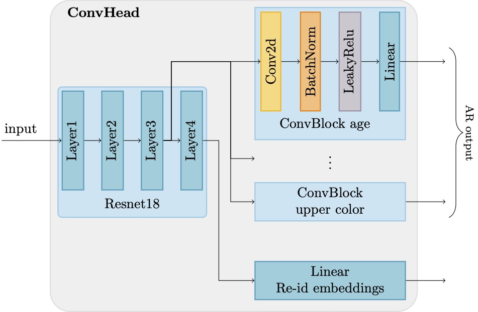
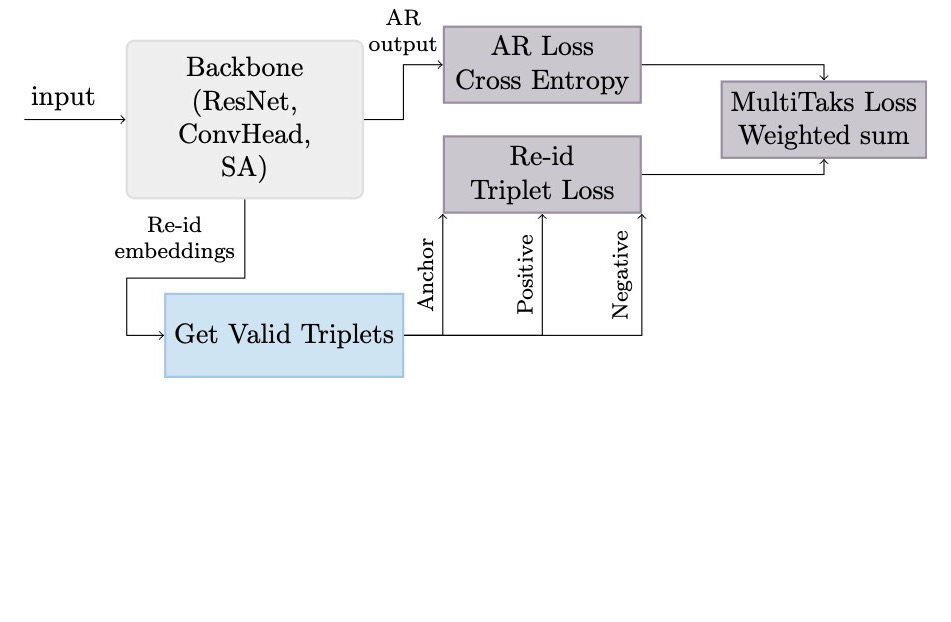

# A Multi-Task Learning Approach to Attribute Recognition and Re-Identification

A multi-task learning approach to person attribute recognition and re-identification. Written in PTorch, trained and evaluated on the [Market-1501](https://github.com/vana77/Market-1501_Attribute) dataset.

## Model architecture

  
  &emsp;&emsp;&emsp;
  

## Results

<table>
<tr><th>Attribute Recognition</th><th>Re-identification</th></tr>
<tr><td>
  
| attribute | ResNet | ConvHead | Self-Attention |
|:----------|-------:|---------:|---------------:|
| age | 78.63 | 83.09 | 74.50 |
| backpack | 81.83 | 82.86 | 75.98 |
| bag | 73.97 | 70.08 | 75.36 |
| handbag | 90.47 | 90.19 | 90.38 |
| clothes | 89.47 | 92.10 | 92.36 |
| down | 89.26 | 87.08 | 85.86 |
| up | 93.94 | 93.62 | 93.10 |
| hair | 84.10 | 84.03 | 84.12 |
| hat | 96.35 | 96.47 | 96.51 |
| gender | 87.80 | 89.37 | 82.14 |
| uppercolor | 69.96 | 69.25 | 65.74 |
| lowercolor | 66.14 | 64.30 | 62.89 |
  
</td><td valign="top">
  
|         | ResNet | ConvHead | Self-Attention |
|:--------|-------:|---------:|---------------:|
| **mAP** | 67.86  | 69.93    | 62.93          |

</td></tr> 
</table>
  
## Get started
This project was developed using Google Colab, to execute it:
- Create a `Deep Learning` folder in the Google Drive root. Alternatively, change the `GDRIVE_HOME_PATH` constant in the notebook to use a custom root path.
- Upload the `.ipynb` notebook to Google Drive.
- Upload the `dataset.zip` file to Google Drive into `Deep Learning/dataset/dataset.zip`. Alternatively, change the `GDRIVE_DATASET_PATH` constant in the notebook to use a custom dataset path.
- Run the notebook.

**Note:** different hyper-parameter combinations can be tested by changing the parameter values of the function `main`, called in the "Run" section. 

## Code structure
The notebook is organized in different sections:
- **Imports:** external libraries imports.
- **Dataset:** definition of the Dataset and BatchSampler classes and a utility to load and transform the data. 
- **Model definition:** implementation of the three models, each with its separate class.
- **Loss functions:** definition of the loss classes: ReIDLoss, AttributeRecognitionLoss and MultiTaskLoss.
- **Accuracy functions:** implementation of the accuracy functions used to evaluate the results for attribute recognition and re-identification.
- **Train and test:** the main logic for training and validating the models.
- **Run:** instantiation of dataset, model, optimizer and loss functions. The hyper-parameters can be configured here. 
- **Final predictions:** construct the final results for the test and query sets.
